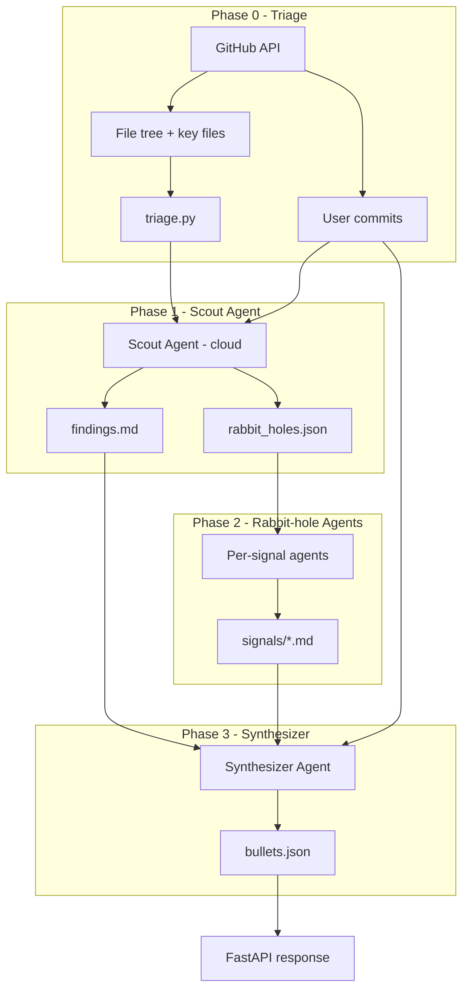

# Resume Bullets Generator — Implementation Plan

Cursor SDK–powered pipeline that analyzes GitHub repositories and produces recruiter-quality resume bullets with traceable evidence.

## Current status (June 2026)

| Milestone | Status |
|-----------|--------|
| 1 — SDK plumbing | ✅ Done |
| 2 — Taxonomy + triage | 🟡 Partial (`triage.py` exists; `taxonomy.yaml` pending) |
| 3 — Scout agent | ✅ Done (validated on `Darksharkthe1st/CodeRunner`) |
| 4 — Rabbit-hole agents | ✅ Done (CLI + `signals/*.md`) |
| 5 — Synthesizer + API | 🟡 Demo (`artifact_loader` → API) |
| 6 — Frontend polish | 🟡 Pipeline UI + bullets on repo detail |

**Demo (hackathon):** Pre-computed artifacts in `backend/data/analysis/` are served via `artifact_loader.py` — `GET /api/analysis/repo/{owner}/{repo}` and instant bullets on `POST /api/analysis/resume/{owner}/{repo}`. Live SDK runs remain CLI-only; heuristic `RepoAgent` is the fallback when no artifacts exist.

## Goals

| Goal | Approach |
|------|----------|
| Recruiter-relevant tech recognition | Shared signal taxonomy + scout agent |
| Deep investigation when warranted | Rabbit-hole agents per high-confidence signal |
| Traceable bullets | Every bullet links to commits, files, and signal notes |
| Fits existing API | Same analysis endpoints; richer async job status over time |

## Architecture

```
Phase 0 (Triage)     →  triage.json          [Python heuristics, no SDK]
Phase 1 (Scout)      →  findings.md         [1 cloud SDK run / repo]
                       rabbit_holes.json
Phase 2 (Rabbit holes) → signals/*.md        [0–N parallel cloud SDK runs]
Phase 3 (Synthesizer)  → bullets.json        [1 cloud SDK run / repo]
```



**Runtime:** Cloud agents (`cursor-sdk`) clone repos on Cursor VMs. Repos must be connected in **Cursor Dashboard → Integrations**. Phase 0 stays on the FastAPI server via GitHub API.

## Artifact layout (per repo)

```
backend/data/analysis/{owner}/{repo}/
  triage.json
  commits.json
  findings.md
  rabbit_holes.json
  signals/                    # Milestone 4
  bullets.json                # Milestone 5
  runs/
    scout.json
    scout_response.txt        # raw agent message (debug)
    scout_artifacts.json      # SDK artifact manifest
    artifacts/                # downloaded artifacts (if any)
    {signal_id}.json          # Milestone 4
    synthesizer.json          # Milestone 5
```

## Code map

```
backend/app/services/analysis/
  triage.py                   # Phase 0 — inline SIGNAL_PATTERNS, triage.json
  repo_agent.py               # Legacy heuristic agent (API path today)
  orchestrator.py             # Parallel per-repo runner (API path today)
  cursor_agents/
    client.py                 # AsyncClient + cloud Agent.create/send/wait
  scout.py                  # Phase 1 orchestration
  rabbit_hole.py            # Phase 2 parallel deep dives
  artifacts.py              # Delimiter + artifact parsing
  prompts.py                # Scout, rabbit-hole, (future synth) prompts
    errors.py                 # CursorAgentError vs run failure
    repo_utils.py             # Connected-repo checks, branch resolution
backend/scripts/
  run_scout.py                # CLI entry point
  run_rabbit_holes.py         # CLI entry point (Phase 2)
```

## Recruiter signal taxonomy

**Today:** signals live inline in `triage.py` as `SIGNAL_PATTERNS` (~12 patterns).

**Milestone 2:** extract to `taxonomy.yaml` with richer metadata. Planned categories:

- **Languages** — Python, TypeScript, Go, Rust, Java
- **Frameworks** — React, Next.js, FastAPI, Django, Spring
- **Cloud & infra** — AWS, GCP, Docker, Kubernetes, Terraform
- **Data** — PostgreSQL, Redis, Kafka, Elasticsearch
- **Practices** — CI/CD, testing, observability, auth/OAuth
- **Architecture** — microservices, event-driven, caching, queues

Each signal will have: `id`, `display_name`, `resume_keywords`, `file_patterns`, `config_markers`, `rabbit_hole_prompt_template`, `min_confidence_to_spawn`.

## Gating rules

| Condition | Action |
|-----------|--------|
| User has 0 commits in repo | Template bullet only, skip SDK |
| Fork with no user commits | Skip |
| < 3 signals above threshold AND < 5 commits | Scout only, no rabbit holes |
| Per repo | Max 3 rabbit-hole agents |
| Per user (analyze-all) | Max 5 repos in parallel (configurable) |

`triage.json` includes `worth_deep_analysis` (basic gating today). Formal rabbit-hole gating is Milestone 2.

## SDK integration

- **Package:** `cursor-sdk` (Python)
- **Async:** `AsyncClient.launch_bridge` + `AsyncAgent`
- **Scout / holes / synth:** `Agent.create` + `send` + `wait`
- **Runtime:** `CloudAgentOptions(repos=[CloudRepository(...)])`
- **Model:** `composer-2.5` (configurable via `CURSOR_MODEL`)
- **Auth:** `CURSOR_API_KEY` in `backend/.env`
- **Repo access:** repo must be connected in Cursor Dashboard → Integrations (`repo_utils.py` validates)

### Output parsing (important)

Cloud SDK `list_artifacts()` currently returns **empty** for scout runs. Parsing uses this priority (`artifacts.py`):

1. **Delimiter blocks** in the agent's final message (primary — scout prompt requires these):
   - `<<<LIGHTROOM_FINDINGS_MD>>>…<<<END_LIGHTROOM_FINDINGS_MD>>>`
   - `<<<LIGHTROOM_RABBIT_HOLES_JSON>>>…<<<END_LIGHTROOM_RABBIT_HOLES_JSON>>>`
2. Downloaded SDK artifacts (if `list_artifacts()` returns paths)
3. Legacy `--- artifact: ---` format
4. Heuristic markdown / JSON extraction from response text

### Error handling

- `CursorAgentError` → run never started (auth, config, network)
- `result.status == "error"` → run started but failed (inspect `run.id`, transcript)
- Log `agent_id` and `run.id` to `runs/*.json` immediately after `send()`

## Cost & safety controls

- Per repo: scout + ≤3 rabbit holes + synthesizer = **max 5 SDK runs**
- Per-user analyze-all: cap at **5 repos** initially
- Timeout: **10 min** per SDK run
- Every prompt: **no fabrication** — bullets require file or commit evidence

## Open decisions

| # | Question | Current default |
|---|----------|-----------------|
| 1 | Private repo cloud clone auth | Repo connected via Cursor Dashboard; `GITHUB_TOKEN` for API triage/commits |
| 2 | Analyze-all vs selective | Single-repo SDK analysis via CLI |
| 3 | Sync vs async API | Blocking for single-repo MVP; `202 + job_id` before analyze-all |
| 4 | Bullet tone | Third-person resume fragments (no "I") |

---

## Milestones (checkpoints)

### Milestone 1 — SDK plumbing ✅

- [x] Add `cursor-sdk` to `backend/requirements.txt`
- [x] Add `CURSOR_API_KEY` / `CURSOR_MODEL` to config and `.env.example`
- [x] Create `backend/app/services/analysis/cursor_agents/` module
  - [x] `client.py` — async cloud agent helpers
  - [x] `errors.py` — `CursorAgentError` vs run failure handling
  - [x] `prompts.py` — prompt templates
  - [x] `artifacts.py` — delimiter + artifact parsing
  - [x] `repo_utils.py` — connected-repo checks, branch resolution
- [x] Smoke test against a Cursor-connected repo (`run_scout.py --smoke`)
- [x] CLI: `backend/scripts/run_scout.py` entry point

**Done when:** `python scripts/run_scout.py` connects to Cursor cloud and returns a run result. ✅

---

### Milestone 2 — Taxonomy + triage 🟡

- [ ] `taxonomy.yaml` with ~20 high-value recruiter signals
- [x] `triage.py` producing `triage.json` (inline `SIGNAL_PATTERNS` today)
- [x] Paginated commit fetch (`list_commits_all`, up to 500)
- [x] Basic gating (`worth_deep_analysis` in triage output)
- [ ] Formal rabbit-hole eligibility rules
- [ ] Unit tests for signal detection from file trees

**Done when:** Triage runs without SDK, uses `taxonomy.yaml`, and writes `triage.json` for any accessible repo.

---

### Milestone 3 — Scout agent ✅

- [x] Scout prompt: confirm signals, write `findings.md`, plan `rabbit_holes.json`
- [x] Delimiter blocks in prompt for reliable parsing
- [x] `scout.py` — orchestrates cloud agent, persists artifacts locally
- [x] `runs/scout.json` — agent_id, run_id, status, duration
- [x] Manual validation on **Darksharkthe1st/CodeRunner** (5 rabbit holes, 116 commits)

**Done when:** Scout produces `findings.md` and `rabbit_holes.json` with recruiter-relevant signals and evidence-backed rabbit-hole recommendations. ✅

---

### Milestone 4 — Rabbit-hole agents 🟡

- [x] Per-signal prompt templates (from `rabbit_holes.json`)
- [x] `rabbit_hole.py` — parallel runner with semaphore (max 3)
- [x] Failure isolation per signal
- [x] `signals/{signal_id}.md` artifacts
- [x] CLI: `backend/scripts/run_rabbit_holes.py`
- [ ] Manual validation on CodeRunner (at least one signal note with evidence)

**Done when:** At least one rabbit hole on CodeRunner produces a signal note with file/commit evidence.

---

### Milestone 5 — Synthesizer + API

- [ ] `synthesizer.py` — merge findings + signals + commits → `bullets.json`
- [ ] Map `bullets.json` → `ResumeBullet` models (extend with `signals`, `confidence`)
- [ ] Wire SDK pipeline into `AnalysisOrchestrator` (replace `RepoAgent`)
- [ ] Optional: `POST /analysis/resume` → `202` + `job_id` polling

**Done when:** `POST /api/analysis/resume/Darksharkthe1st/CodeRunner` returns SDK-generated bullets with evidence.

---

### Milestone 6 — Frontend polish

- [ ] Progress states (triage → scout → rabbit holes → synthesizing)
- [ ] Expandable evidence per bullet
- [ ] Signal tags on bullets

**Done when:** UI shows live analysis progress and evidence for each bullet.

---

## Implementation order

1. ~~**Milestones 1 + 3** on CodeRunner~~ ✅
2. **Milestone 4** — rabbit holes on signals scout recommends (CodeRunner has 5 queued)
3. **Milestone 2** — formalize `taxonomy.yaml` (can parallelize with M4)
4. **Milestones 5 + 6** — wire SDK pipeline to API and frontend

## What we keep from MVP

- GitHub OAuth + repo listing
- `findings.md` as scout's durable artifact
- `ResumeBullet` schema (extended in Milestone 5)
- Orchestrator parallel-per-repo pattern (SDK replaces `RepoAgent` in Milestone 5)
